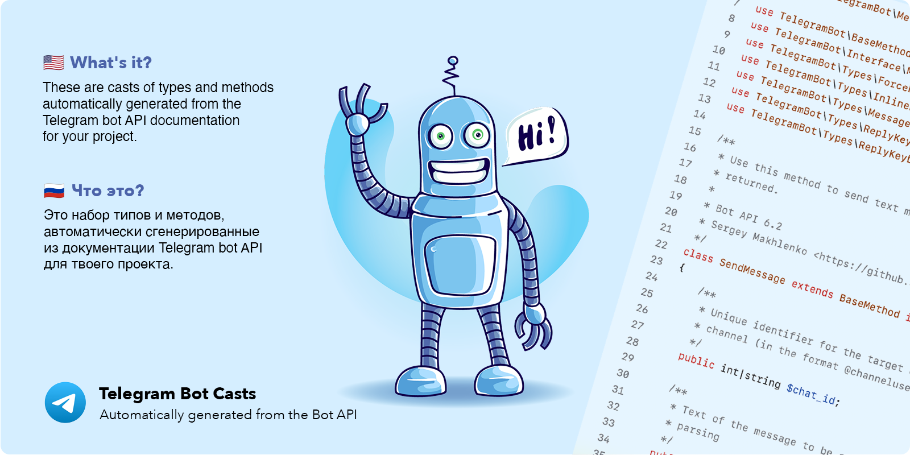

[](https://opensource.org/licenses/MIT)

Проект содержит описания всех типов и методов из документации Telegram Bot API.
Файлы сгенерированы автоматически с помощью [mahlenko/telegram-api-parser](https://github.com/mahlenko/telegram-api-parser).

Проект обновляется ежедневно, с помощью GitHub Action.

**В планах:**
- Добавить тесты и убрать пометку DEV

# Простая установка

```shell
composer require appto-team/telegram-bot-cast-laravel@dev
```

## ☕️ На кофе


Вы всегда можете отправить благодарность на чашку кофе или больше 😉 на мой TON кошелек (USDT, TON)
`appto-wallet.ton`
